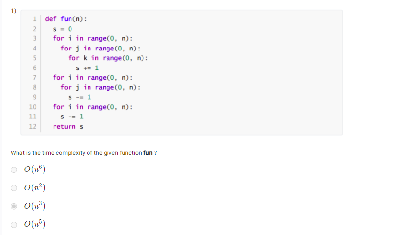
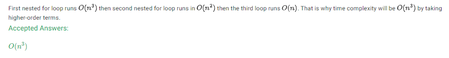
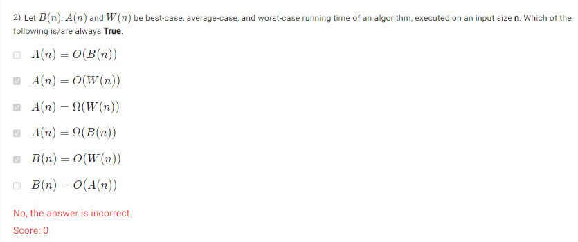
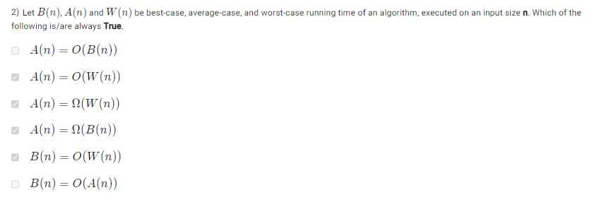
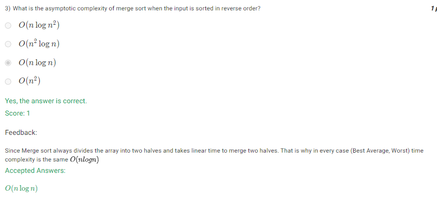
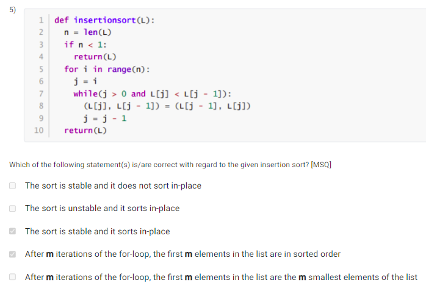
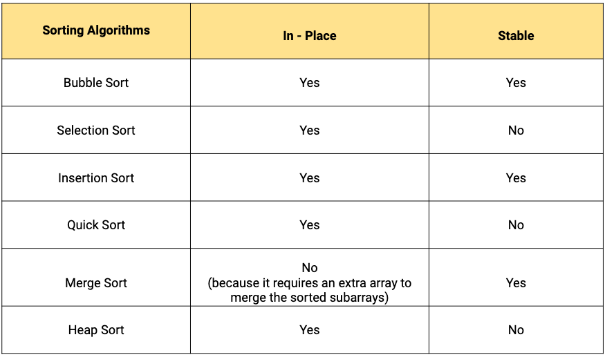
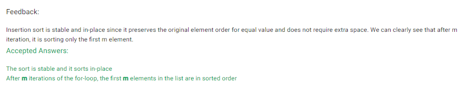

- Look for highest number of nested loops

- A stable sort is one that preserves the relative order of elements with equal keys
- An in-place sort is one that uses only a small amount of additional memory.
- These two properties are independent of each other, meaning that a sorting algorithm can be stable, in-place, both, or neither.

    
    
