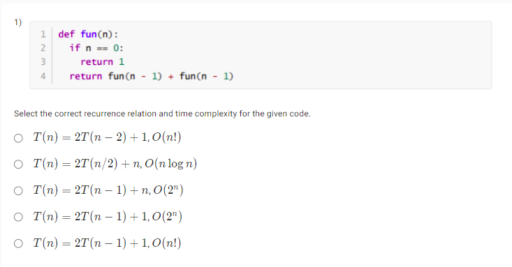
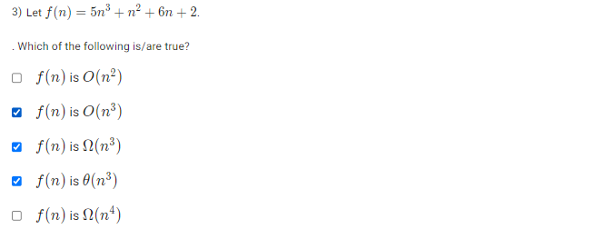

- Refer this website for Recurrence Relation : https://algorithmtutor.com/Analysis-of-Algorithm/Recurrence-Relation/
- O(2N) runtime complexities are often seen in recursive functions that make 2 recursive calls and pass in the problem size of N-1.

