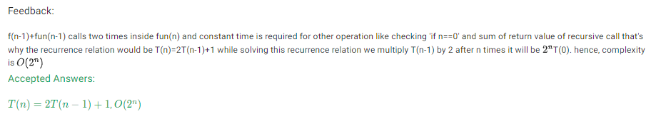
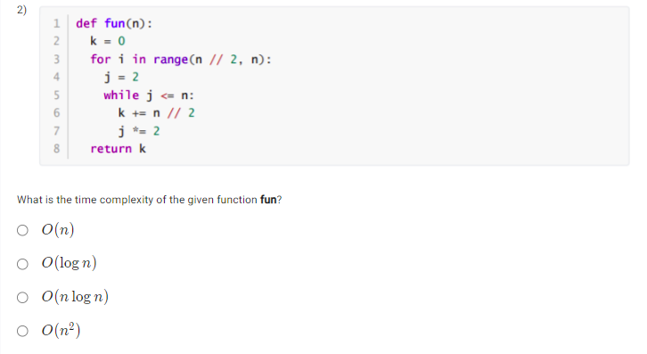
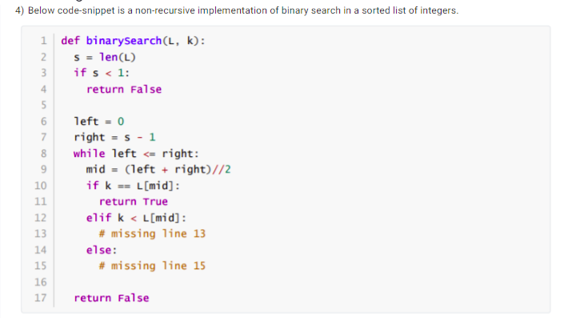
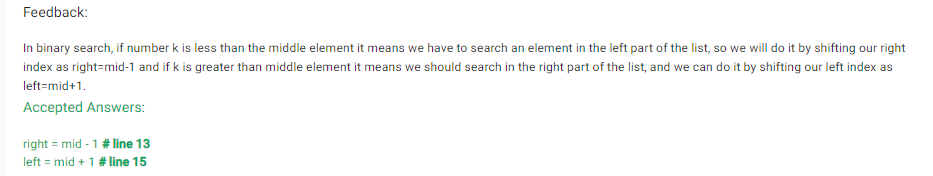

- Refer this website for Recurrence Relation : https://algorithmtutor.com/Analysis-of-Algorithm/Recurrence-Relation/
- O (2N) runtime complexities are often seen in recursive functions that make 2 recursive calls and pass in the problem size of N-1.
Website: https://dev.to/lofiandcode/big-o-part-5-2-n-2ifn

- *f (n) = 5n3 + n2 + 6n +2*, we can say that as n approaches infinity, the 5n3 term will dominate the other terms.

